# ddg

<p align="center">
  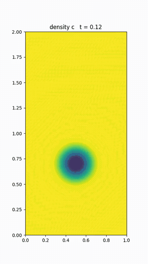
</p>
<p align="center">
  <em>A Boussinesq rising bubble in a closed box, ~41k DOFs/field, matrix-free CG with an hp-multigrid pressure preconditioner and matrix-free block-Jacobi viscous and scalar preconditioners. T = 20 on a 16-vCPU CPU host. One of the application setups this library solves end-to-end through JAX.</em>
</p>

Differentiable discontinuous Galerkin solvers in JAX ([paper draft](docs/paper.pdf)). A suite of
state-of-the-art nodal-DG solvers for nonlinear partial differential
equations, structured so that every
spatial operator, every flux, every mesh builder, and every time
integrator is end-to-end JAX-traceable. The whole pipeline composes
with `jax.grad`, `jax.jit`, and `jax.vmap`.

## What's here

- **Forward solvers** (verified against textbook setups, spectral
  convergence demonstrated):
  1D advection, 1D wave / Maxwell-style, 1D heat (with optional
  body-force source for Poiseuille channel flow), 1D Burgers
  (viscous + inviscid with a minmod limiter), 1D Poisson (IPDG),
  2D advection, 2D Maxwell TM, 2D Poisson (IPDG and SIPG with
  mixed Dirichlet/Neumann BCs), 2D Helmholtz, and a complete family
  of 2D incompressible Navier-Stokes schemes: vorticity-
  streamfunction (explicit RK4 + implicit DIRK/SDIRK) and the
  velocity-pressure formulation (Hesthaven dual splitting, Fehn
  consistent splitting, monolithic coupled saddle-point), all with
  optional divergence/continuity penalty stabilization and
  matrix-free CG / GMRES for GPU scaling.
- **Optimization through the solver** (every demo a twin experiment
  or a clean control problem; `jax.value_and_grad` does the rest):
  - *Shape optimization*, adapt mesh vertices to minimize an
    interpolation or solver error, in 1D, 2D, and through the full
    Burgers time integration.
  - *Boundary control*, find a Dirichlet schedule that drives an
    interior state toward a target. Practical and twin-experiment
    versions.
  - *Inverse problems*, recover the unknown when it lives in the
    initial state, the operator coefficient, the source term, the
    boundary inflow, a wave speed, or a spectral target. Plus a
    2D inverse permittivity demo.
- **Library invariants**: a pytest gradient-check suite that
  validates `jax.grad` against centered finite differences across
  representative pipelines, plus spectral / h convergence tests for
  every forward solver.

The whole stack is float64 / CPU JAX by default (Metal is float32 and
that's not enough for spectral DG). All animations are encoded to
broadly-compatible H.264 / yuv420p MP4 and GIF.

## Solvers

The library is a complete 2D discontinuous-Galerkin incompressible
Navier–Stokes stack: an H(div)-conforming `BDM_k` velocity /
discontinuous `P_{k-1}` pressure discretization solved either by a
monolithic coupled-Newton step or a factored-once block-Schur
projection, alongside the vorticity–streamfunction formulation and 2D
Maxwell. Every solver runs on CPU in float64 or on GPU through a
matrix-free iterative path (see the notes at the end). A few
representative 2D results follow.

### 2D Navier-Stokes: velocity-pressure formulation

The vorticity-streamfunction NS above is limited to
free-slip walls (the `ψ = 0` BC). To handle **no-slip obstacles**,
inflow/outflow, drag and lift coefficients, mass conservation
diagnostics (the standard menagerie of viscous-flow benchmarks) we
switch to a velocity-pressure formulation, with four operator-split
or monolithic schemes that follow Hesthaven [1] and the
Fehn–Wall–Kronbichler (exadg) family of papers [2, 3]:

| scheme | source | how |
|---|---|---|
| **Dual splitting (BDF1/BDF2)** | Hesthaven `CurvedINS2D.m` | advect → pressure-Poisson with consistent Neumann `−n·(N + ν∇×∇×U)` → viscous Helmholtz |
| **Consistent splitting** | Fehn et al. 2017 [2] | pressure equation is `-Δp = -∇·N(U)` in weak form + BDF-discretized time-derivative in the Neumann BC. Stable in the small-dt limit where dual splitting goes unstable |
| **Monolithic coupled** | exadg `BDFCoupledSolution` | solve `[A G; -D 0] [u;p] = b` saddle-point per step with Picard-linearized advection (`u* = BDF-extrapolated`). Sign-flipped divergence for symmetry; divergence + continuity penalty in the velocity block for inf-sup stabilization |
| **Penalty post-projection** | Fehn et al. 2018 [3] | optional `(M + τ_d D_pen + τ_c C_pen) U_new = M U_int` solve after the viscous step, weakly enforces incompressibility + inter-element continuity. Robustness boost for under-resolved turbulent flows |

All four share a **SIPG primal-form Poisson** with native mixed
Dirichlet/Neumann BCs in `dg2d/sipg.py` (the LDG-form operator in
`dg2d/poisson.py` can't support mixed BCs cleanly, its per-element
LIFT correction spills into Neumann face nodes and breaks symmetry).
The SIPG operator is symmetric to ~1e-13, passes 13 manufactured-
solution tests, and powers both the pressure Poisson and the viscous
Helmholtz solves throughout the splitting schemes.

The whole stack also has a **matrix-free CG / GMRES path** (set
`iterative=IterativeConfig(method="cg", tol=1e-9, ...)`) that avoids
assembling dense matrices entirely, the only viable path for serious
GPU scaling. CG matches direct LU to ~5e-8 on the splitting schemes
and is ~4× faster than dense LU at 12×12 N=4 on CPU; the gap widens
with mesh size.

### Convergence and benchmarks

The `BDM_k` / `P_{k-1}` pair is verified across a benchmark cascade. On
the steady Stokes problem it holds a machine-zero pressure-robustness
floor independent of mesh size; the Kovasznay flow [5] recovers the
optimal `h^(k+1)` spatial rate; and the unsteady Taylor–Green vortex
recovers the design BDF1 / BDF2 temporal orders.

<p align="center">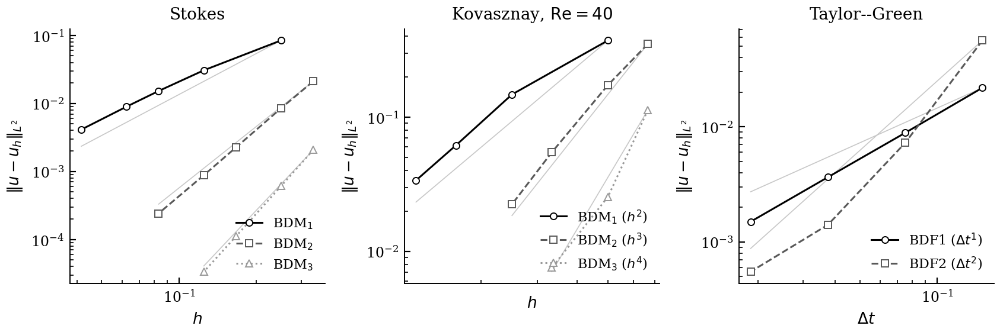</p>

Beyond convergence the solver is validated on the Ghia lid-driven cavity
(centerline profiles matched at `Re ∈ {100, 400}`) and the Boussinesq
rising bubble (the masthead animation).

### Flow past a cylinder: von Kármán vortex street

The Schäfer–Turek 2D-2 benchmark [4]: a channel `[0, 2.2] × [0, 0.41]`
with a circular cylinder on a body-fitted curved O-grid, parabolic
inflow, `Re = 100`. Above the shedding threshold the wake destabilizes
into a periodic von Kármán vortex street, computed here at order 3
(`BDM_3`) with the H(div)-conforming block-Schur projection solver
(vorticity shown).

<p align="center">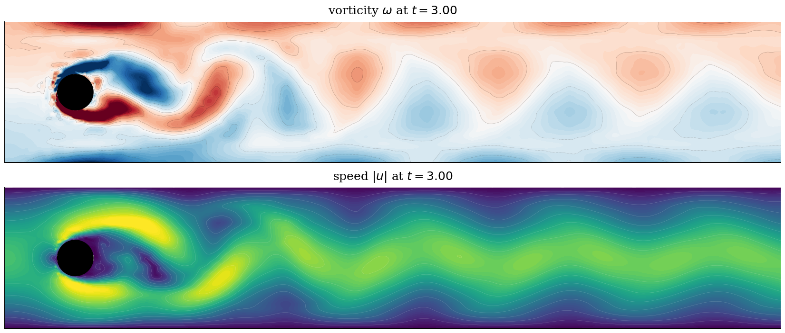</p>

The solver reaches a mean drag `⟨C_D⟩ ≈ 3.52` (Schäfer–Turek reference
`3.22`), a clean lift limit cycle, and Strouhal number `St ≈ 0.26`,
with the discrete divergence held at `‖∇·u‖ ≲ 1e-8` throughout the
developed window.

<p align="center">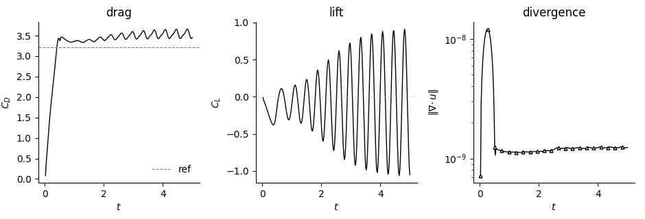</p>

### Projection vs monolithic

The same discretization is solved two ways: a monolithic coupled-Newton
step (dense LU, re-factored each step) and a block-Schur projection that
factors its blocks once and reuses them. The two agree to the
spatial-discretization floor (`~5e-5` relative on matched trajectories),
while the projection runs several times faster per step (≈ 4–5.5× at the
finest meshes of the scaling sweep, and up to ~21× on the stiff
`Re = 400` cavity step).

<p align="center">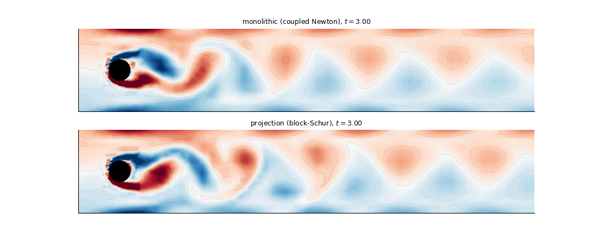</p>

### 2D TM Maxwell in a PEC cavity
`H_t = ∇⊥E_z`, `E_z,t = ∇×H` on a square `[-1, 1]² ` cavity with
perfectly-conducting walls. Initial Gaussian pulse on `E_z` with
`H = 0`. K = 1152 right-triangles (24×24 cells split along the
diagonal), N = 4 → 17,280 dofs per field. Upwind Riemann flux
following Hesthaven §6.6. The pulse splits at the walls, bounces, and
re-coheres into nontrivial standing-wave patterns; energy is preserved
to 5+ digits over the run.

<p align="center">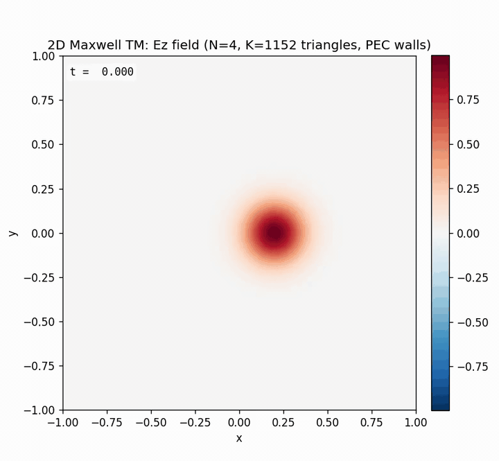</p>

## Differentiable applications

Because every operator, flux, mesh builder, and time integrator is
JAX-traceable, the solver composes with `jax.grad`: an optimizer can
differentiate straight through a full flow solve at a cost independent of
the number of parameters. The results below optimize through the 2D
incompressible solver; a panel of 1D differentiable demos follows.

### Active wake suppression: differentiable flow control

Because the whole solver is differentiable, the same cylinder becomes a
control problem. A zero-net-mass-flux (ZNMF) synthetic jet on the body
surface is actuated by an azimuthal schedule that Adam optimizes to
minimize the downstream wake enstrophy, the gradient supplied by
reverse-mode AD through the entire time-stepping loop, at a cost
independent of the number of control parameters. The learned controller
cuts the time-averaged downstream wake enstrophy by **72.9 %** at
`Re = 100`.

<p align="center">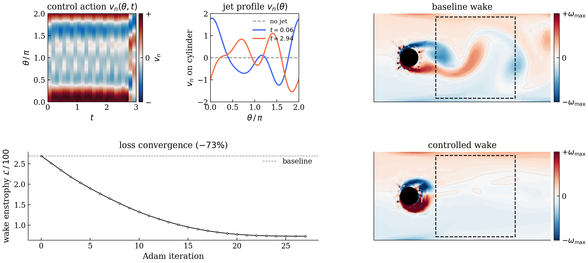</p>

*Top left:* the learned control action `v_n(θ, t)` around the body (a
zero-net-flux jet, red blows out, blue sucks in). *Top center:* the
azimuthal jet profile early vs late in the window. *Bottom left:* the
wake-enstrophy loss descending under Adam. *Right:* baseline
(uncontrolled) vs controlled downstream vorticity on a shared scale, the
jet clears the coherent shedding from the dashed objective box.

### Drag-minimizing shape optimization (2D)

The differentiable curved mesh turns body design into gradient descent on
geometry. Starting from a bluff cylinder at `Re = 20`, projected Adam
reshapes the body (through a Gordon–Hall curved mesh) to cut steady
drag, for both a single mode-2 deformation and a conformal
Kármán–Trefftz / Joukowski family. The mode-2 body drops `C_D` by `17 %`
below the cylinder; the streamlined conformal body reaches `34 %` below.

<p align="center">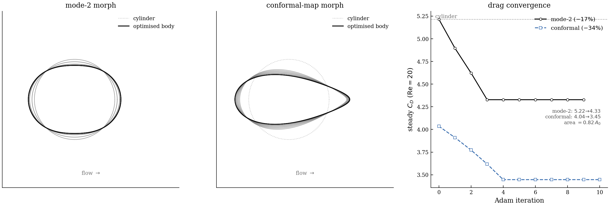</p>

### Learned solver parameters

The numerical scheme's own knobs are differentiable design variables.
Two examples: jointly optimizing the time step and SIPG penalty
`(Δt, τ)` to push a cavity solve to the edge of stability, and learning
the per-patch Jacobi-smoother weights `ω` inside the hp-multigrid
V-cycle by backpropagating through the linear solve.

<p align="center">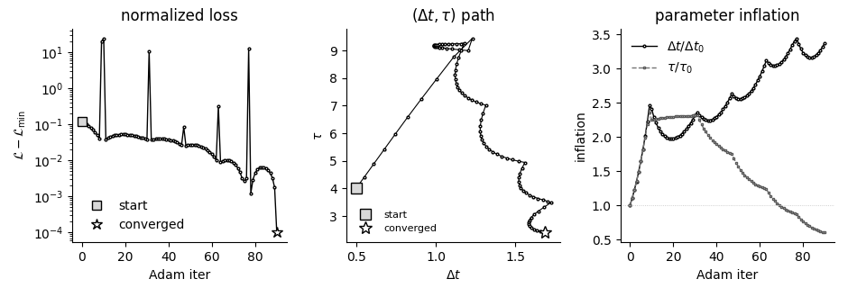</p>

<p align="center">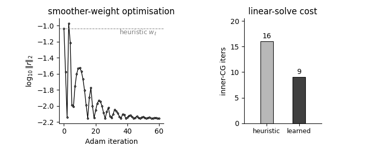</p>

### Shape optimization through the mesh

This demo makes "differentiable" concrete: the same `Mesh1D`
builder used by every solver is JAX-traceable through vertex positions
`VX`. We can therefore put a mesh-dependent quantity inside a loss and
let `jax.grad` deliver gradients in mesh space.

**The problem.** Approximate the sharply-peaked target

```
f(x) = exp(-100 (x - 0.3)²)         on  [-1, 1]
```

on a DG mesh of fixed budget: **8 elements** of polynomial order
**N = 4**. The natural baseline is the uniform mesh
`x_k = -1 + 2 k/K`. The bulk of the target lives in a narrow window
near `x = 0.3`, so a uniform mesh wastes most of its degrees of freedom
on regions where the function is essentially zero. Can we move the
seven interior vertices around to do better, *without changing the
element count or polynomial order*?

**The loss.** The nodal interpolant `I_h f` agrees with `f` exactly at
the mesh nodes but differs in between. The L2 interpolation error

```
L(VX) = ∫₋₁¹ ( I_h f - f )²  dx
```

depends on the vertex positions `VX` through (1) where the nodes sit,
which determines where `I_h f` is anchored, and (2) the affine map per
element used to upsample `I_h f` to sub-quadrature points for the
integral. We integrate `L` with a high-order Gauss rule on each
element so the squared-error quadrature is exact for polynomials of
degree `≤ 2N`.

**How we optimize.** To keep the mesh non-degenerate without
constrained optimization, we re-parameterize the seven interior
vertices through *element widths*: define `w = softmax(logits) · 2`
(the domain length) and then `VX = -1 + cumsum(w)`. With this change of
variables, any real-valued `logits ∈ R^K` produces a valid mesh with
positive element widths summing to 2. We then minimize `L` via
momentum SGD (`lr = 5.0`, momentum `0.9`, 1500 steps) directly in
`logits`-space using `jax.value_and_grad`. **No manual
adjoint or sensitivity calculation is needed**: gradients flow
automatically through `update_mesh_vertices(mesh, VX)` (which rebuilds
the JAX-traced geometric fields `x, J, rx, Fscale`), through the
nodal-interpolant evaluation on a sub-quadrature, and through the
weighted error sum.

**Result.** The optimizer concentrates elements around `x = 0.3` and
places a vertex *exactly* at the Gaussian peak. The interpolation
error drops by ~**50×** versus the uniform-mesh baseline. The
animation below shows the optimization in progress: the red curve
(optimized interpolant) sweeps in to track the target as the red
vertices (mesh layout) migrate. The bottom panel tracks both the
current loss `L(VX)` (green) against the uniform-mesh baseline
(dashed blue) and the cumulative *gain factor* `L_uniform / L(VX)`
(orange), so you can read off the speedup over baseline directly: it climbs from 1× at step 0 to ~50× by the time the optimizer
saturates.

<p align="center">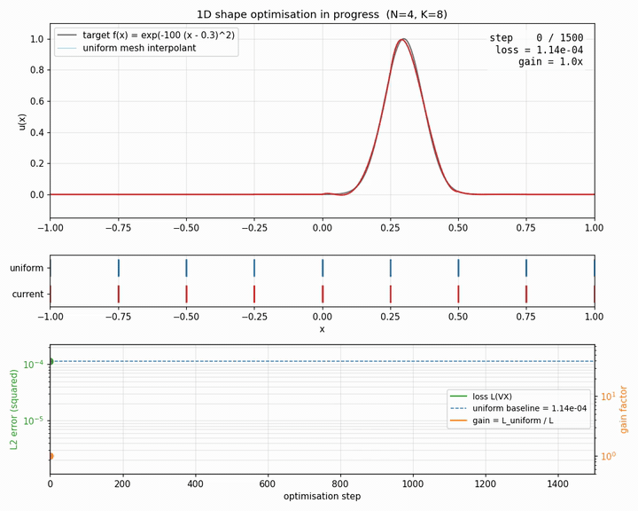</p>

### Shape optimization through the viscous Burgers solver

The previous shape-opt demo minimizes a *static* interpolation error.
This one minimizes an error that is the output of the full Burgers
solver run to a final time `T`, so the gradient now flows through

```
update_mesh_vertices(mesh, VX)
    → Burgers RHS (volume + face flux + LDG auxiliary q)
        → ~400 RK4 stages via lax.scan
            → L2 inner product on a high-order sub-quadrature
```

end-to-end. Everything in that chain is pure JAX, so
`jax.value_and_grad` produces finite gradients without a single
hand-written sensitivity calculation, backprop through the trajectory
is the same operator as backprop through any other pure JAX function.

**Setup.** Hesthaven's traveling-wave problem with a *sharper* viscosity
(`ν = 0.02`, so the shock front has thickness ~ 0.04):

```
u_exact(x, t) = 1 - tanh( (x + 0.5 - t) / (2 ν) )      on [-1, 1]
```

`N = 4`, `K = 8`, `T = 0.5`, so the steep front lands at `x = 0`. We
parameterize the eight element widths through softmax (same trick as
the 1D / 2D static demos) and run 1500 steps of momentum SGD with the
same piecewise LR schedule.

**Result.** The optimizer narrows two cells to widths ~0.13 and ~0.10
*exactly around `x = 0`*, right where the steep gradient sits at the
final time. Far-field cells widen to 0.30+. Error drops ~**54×** vs
the uniform-mesh Burgers run.

<p align="center">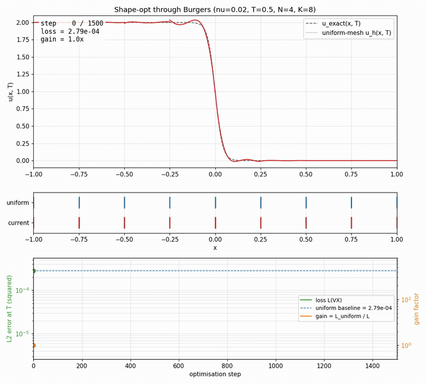</p>

### Shape optimization on a 2D structured mesh

The natural 2D analog: target

```
f(x, y) = exp( -((x - 0.3)² + (y - 0.2)²) / (2 · 0.10²) )
```

on `[-1, 1]²`, with a structured `Kx × Ky = 8 × 8` rectangle mesh
(each cell split along its lower-left → upper-right diagonal into two
triangles, so 128 triangles total of order `N = 3`).

**Parameterization.** A tensor-product mesh of this kind is fully
specified by the positions of its `Kx + 1` vertical and `Ky + 1`
horizontal grid lines. We optimize the `Kx + Ky = 16` *element
widths* (one per row of cells, one per column), each set
softmax-normalized so widths stay positive and sum to the domain
length. There are therefore 16 free scalars; vertex positions are
recovered as a cumulative sum.

**Loss.** Same shape as the 1D version, L2 squared interpolation
error of the nodal interpolant `I_h f`. On triangles we integrate via
a tensor-product Gauss rule mapped through the Duffy transform
`(a, b) → (r, s)`, with the rule chosen high enough to be exact for
polynomials of total degree `2N`. Gradients flow through
`update_mesh_2d_vertices(mesh, VX, VY)`, the same JAX-traced
geometric-factor builder the Maxwell and advection solvers use, and
the tensor-product width construction is autodiff-friendly by
construction.

**Result.** Independent x- and y-line migration concentrates cells
around `(0.3, 0.2)` (the peak) and leaves wider cells in the
low-amplitude corners. The error drops by ~**45×** vs the
uniform-mesh baseline (4000 steps of momentum SGD with a piecewise
LR drop at 60% / 85% of training; the schedule lets the late-stage
refinement settle to a clear plateau).

<p align="center">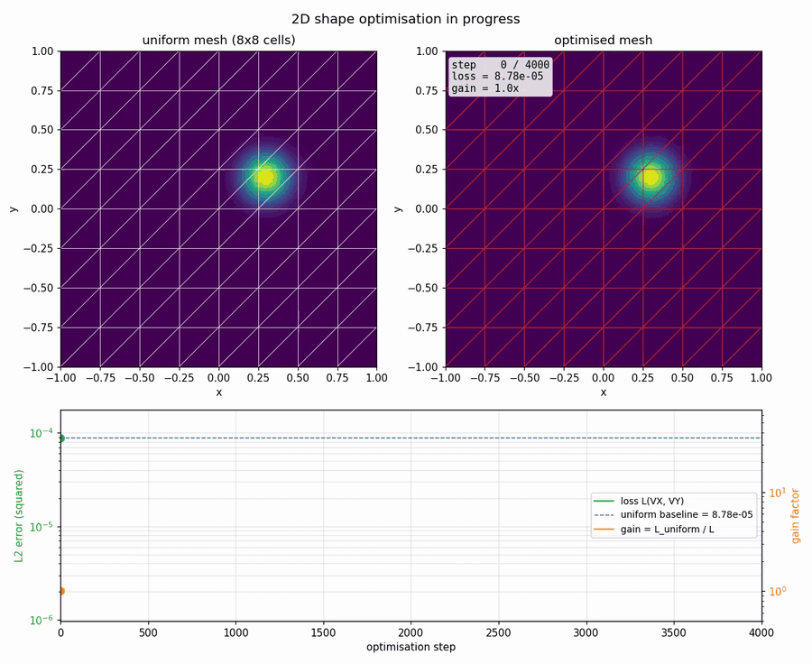</p>

### Boundary control through the heat equation

The shape-opt demos optimize *mesh geometry*. This one keeps the mesh
fixed and optimizes *boundary condition values* instead, an inverse
heat-conduction problem. The setup is the textbook "find the wall
temperature schedule that produces a desired interior heat profile":

```
u_t = κ u_xx                  on [0, 1]
u(x, 0) = 0                   (rod starts cold)
u(0, t) = g(t)                ← control: time-varying left-wall temp
u(1, t) = 0                   (right wall held cold)
```

with `κ = 1`, final time `T = 0.1`. The control `g(t)` is parameterized
as a piecewise-linear function with 20 knots evenly spaced over
`[0, T]` (`jnp.interp` does the interpolation, so it's differentiable).
The *target* is a Gaussian warm spot at `x = 0.2`,
`u_target(x) = 0.8 · exp(-50 (x - 0.2)²)`, and the loss is the L2
error between `u_h(x, T)` and `u_target`.

Why this fits the differentiable-solver story: `jax.value_and_grad`
now backprops:

```
g (20 control knots)
    → jnp.interp at every RK4 sub-stage
        → heat RHS (BC enters through the half-jump at face 0)
            → 400 forward steps via lax.scan
                → L2 inner product against the target
```

No hand-written adjoint, just `jax.grad` on a pure JAX program.

**Regularization.** Inverse heat conduction is ill-posed:
without help, the optimizer exploits the fact that the *very last*
knot of `g(t)` has no time to diffuse and learns wild high-amplitude
oscillations there that "patch up" the boundary value of `u_h` without
affecting the interior. A small Tikhonov penalty on the second
difference of `g` (`λ = 5e-5`) suppresses that artifact and yields a
smooth, physically interpretable schedule: a brief warming phase, an
active *cooling* phase that pushes the heat front off the boundary,
then a re-warming pulse near the end.

**Result.** ~50× reduction in L2 error. The recovered `g(t)` is the
control schedule that drives the cold rod toward the target warm
spot in the time budget allowed.

<p align="center">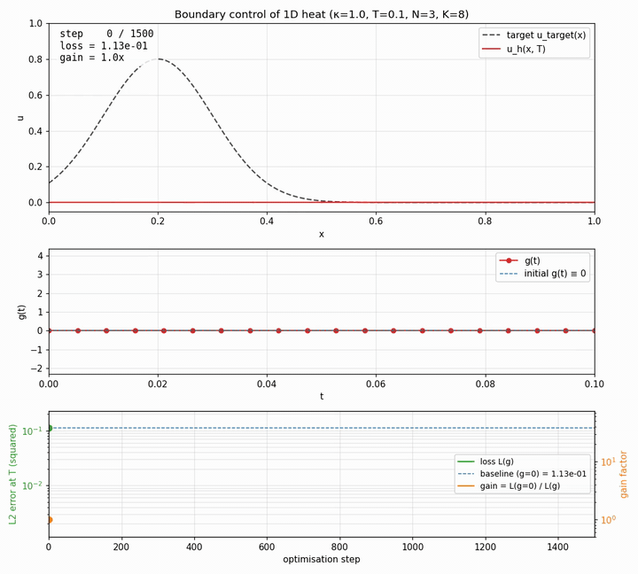</p>

### Twin experiment: do we recover the true boundary schedule?

The previous BC-control demo solves a *practical* inverse problem
(approximate a freely-chosen target with a regularized optimizer).
This demo answers a different question: **if a true solution exists,
does the optimizer actually find it?** The standard data-assimilation
trick: cook up a known boundary schedule `g_true(t)`, run the forward
solver to manufacture a synthetic target
`u_target = u_h(·, T; g_true)`, then start the optimizer from
`g = 0` and check whether it recovers `g_true`.

**Two diagnostics, two stories.** The bottom panel now plots both
the data loss (`||u_h(g) - u_target||²`, green) and the *parameter
error* (`||g - g_true|| / ||g_true||`, orange) on twin log axes.
Data loss going to zero only proves we matched the observation; the
parameter error tells us whether the recovered control matches the
true one.

**The null-space trap.** A naive single-final-time observation reveals
the textbook ill-posedness of inverse heat conduction. Even with
`g_true` cooked up by the same solver and only 6 control knots,
the data loss converges to ~1e-8 while the parameter error stalls
at ~20%. The heat operator at `T = 0.1` simply has a non-trivial null
space, `g(t)` values near `t = T` haven't had time to diffuse, so
multiple boundary schedules produce indistinguishable `u(·, T)`.

**The fix.** Multi-time observation: instead of comparing only at
`t = T`, we observe `u_h` at 5 evenly-spaced times during the
integration and sum the L2 errors. Each extra observation slices out
more of the null space, and with 5 of them the inverse is well-posed.
After 1200 steps of momentum SGD with no regularization, the data
loss drops to **3 × 10⁻³²** and the parameter error to **2 × 10⁻¹⁶**
Machine precision in both. The recovered `g(t)` curve sits exactly
on top of `g_true(t)`.

<p align="center">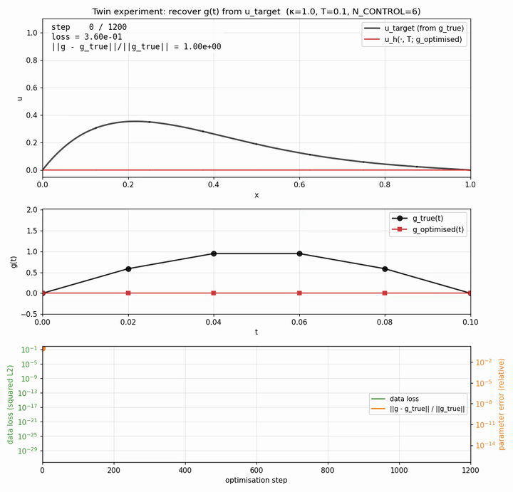</p>

### Inverse problems: "where does the unknown live?"

A panel of seven optimization-style demos sharing the same core
pattern, cook up a known truth, forward-solve to manufacture a
synthetic observation, then optimize the parameters and verify the
optimizer recovers (or at least closely tracks) the truth. They
collectively show that the same `jax.value_and_grad` works no matter
where in the PDE the unknown sits.

**Initial condition** (`applications/ic_recovery_advection_1d.py`).
Periodic 1D advection. Cook up `u₀_true(x)`, forward-advect to T,
then recover `u₀` from `u(x, T)`. Pure advection is unitary so the
inverse is well-posed, backprop literally reverses the wave.
Parameter error: **2 × 10⁻¹⁶**.

<p align="center">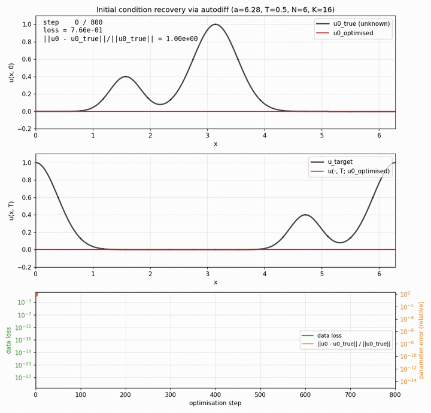</p>

**Operator coefficient** (`applications/material_id_heat_1d.py`).
1D heat with spatially-varying `κ(x)`. Recover `κ` (RBF-parameterized
log) from 20-time-point trajectory observation. Parameter error: ~5%.

<p align="center">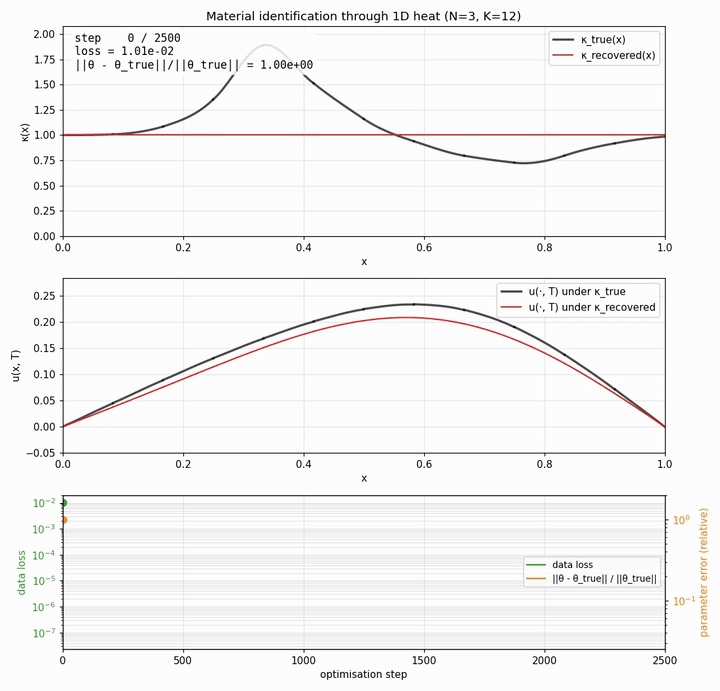</p>

**Boundary inflow** (`applications/inflow_control_burgers_1d.py`).
Optimize the time-varying inflow `u(xL, t)` of viscous Burgers so the
shock at final time T parks at a target location. 1683× error
reduction over a zero-inflow baseline.

<p align="center">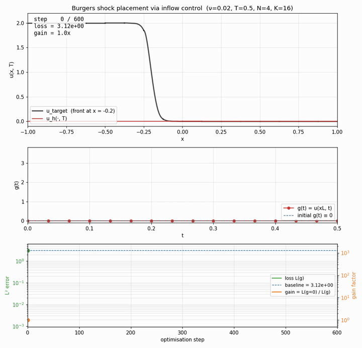</p>

**Wave speed from receiver traces** (`applications/wave_speed_inversion_1d.py`).
Seismic-style full-waveform inversion. Place 4 receivers in a 1D PEC
cavity, launch a Gaussian pulse, record `E_z(receiver, t)` over time,
recover `ε(x)` so the simulated traces match. Parameter error: ~2%.

<p align="center">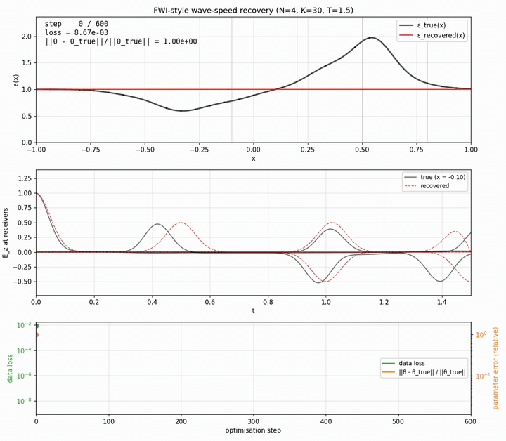</p>

**Eigenvalue placement** (`applications/eigenvalue_opt_poisson_1d.py`).
Optimize mesh vertex positions so the smallest eigenvalue of the
assembled IPDG stiffness matrix matches a chosen target.
`jax.grad` composes with `jnp.linalg.eigvalsh`; eigenvalue placement
to **3 × 10⁻¹³** accuracy.

<p align="center">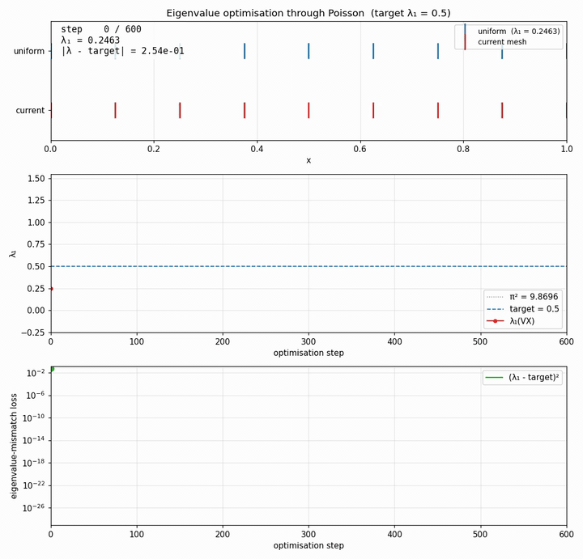</p>

**2D inverse permittivity design** (`applications/lens_design_maxwell_2d.py`).
2D TM Maxwell with a heterogeneous
`ε(x, y)`, recovered from a single snapshot of `Ez(·, T)` after a
Gaussian pulse propagates through a square PEC cavity. ε is
parameterized by a 4×4 grid of RBF bumps. Backprop through 300 RK4
stages of full 2D Maxwell + the L2 inner product on the final state.
The structure of `ε_true` is recovered cleanly even though heat-style
null-space prevents full parameter recovery from a single-time
observation (multi-time observation would close that gap at the cost
of significantly more compute).

<p align="center">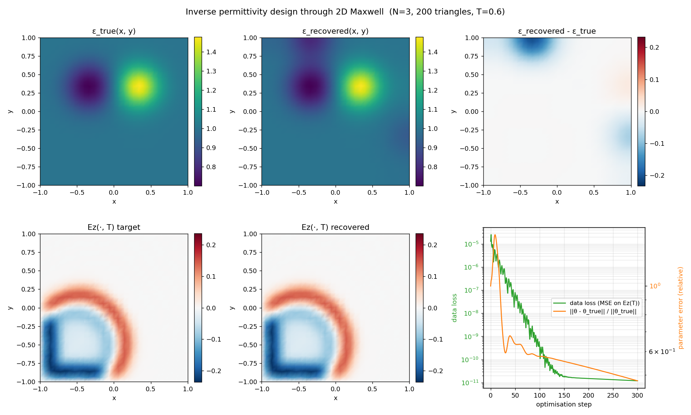</p>

A common regression test (`test/test_gradient_check.py`) validates
`jax.grad` against centered finite differences for four representative
pipelines (advection forward, heat with time-varying BC, Poisson solve,
mesh-vertex update), the safety net for all of the above.

## Repository layout

```
ddg/
├── src/ddg/                # solver library (importable as `ddg.dg1d`, `ddg.dg2d`)
│   ├── dg1d/
│   │   ├── reference.py    # Jacobi/Vandermonde/Dr/LIFT (1D reference element)
│   │   ├── mesh.py         # Mesh1D pytree + builders, update_mesh_vertices
│   │   ├── integrator.py   # 5-stage low-storage RK4 over jax.lax.scan (pytree state)
│   │   ├── advection.py    # 1D linear advection (upwind flux)
│   │   ├── wave.py         # 1D Maxwell-style wave (Riemann flux, PEC)
│   │   ├── heat.py         # 1D heat (central-flux LDG, explicit RK4)
│   │   ├── burgers.py      # 1D Burgers, viscous + inviscid (LF flux + minmod limiter)
│   │   └── poisson.py      # 1D Poisson IPDG (dense matrix or matrix-free)
│   └── dg2d/
│       ├── reference.py    # warp-and-blend triangle nodes, Koornwinder basis
│       ├── mesh.py         # Mesh2D pytree, structured-rectangle triangulation,
│       │                   # square-hole mesh (rectangle_with_square_hole_mesh_2d)
│       ├── curved.py       # optional curved-boundary projection + Gordon-Hall
│       │                   # interior blending (apply_circular_hole_2d)
│       ├── advection.py    # 2D linear advection (upwind Riemann flux)
│       ├── maxwell.py      # 2D Maxwell TM (Hx, Hy, Ez) with PEC walls
│       ├── poisson.py      # 2D Poisson LDG/IPDG (Dirichlet only, used by
│       │                   # the vorticity-streamfunction NS)
│       ├── sipg.py         # 2D Poisson + Helmholtz in SIPG primal form, with
│       │                   # native mixed Dirichlet/Neumann BCs; matrix-free
│       │                   # CG via IterativeConfig for GPU scaling
│       ├── navier_stokes.py    # 2D incompressible NS (vorticity-streamfunction,
│       │                       # explicit RK4 + implicit DIRK/SDIRK)
│       ├── incompressible_ns.py # velocity-pressure NS, dual / consistent
│       │                        # splitting schemes (Hesthaven + Fehn 2018),
│       │                        # divergence + continuity penalty post-projection
│       ├── coupled_ns.py   # monolithic saddle-point NS (exadg-style coupled
│       │                   # solver, Picard-linearized convection)
│       ├── ins_metrics.py  # KE, enstrophy, ‖∇·U‖, mass flux, drag/lift,
│       │                   # Strouhal-from-FFT, recirculation length
│       └── run_metrics.py  # RunReporter writing JSON / CSV / markdown bundle
├── test/                   # pytest suite (140 tests; full run ~15 min on CPU)
├── applications/           # runnable demos that produce output/ artifacts
├── docs/                   # gpu_runs.md, exadg_survey.md
├── assets/                 # GIFs/PNGs embedded in this README (tracked)
├── output/                 # rendered MP4s/PNGs/JSON/CSV/markdown from runs (gitignored)
├── reference/nodal-dg/     # upstream MATLAB reference (gitignored)
├── reference/exadg/        # upstream exadg INS reference (gitignored)
└── pyproject.toml
```

## Setup

Requires Python 3.10+ and a conda env (this project uses `ddg`):

```bash
conda create -n ddg python=3.12
conda activate ddg
pip install -e ".[dev]"
```

To also install the Apple Metal JAX plugin (float32 only; the library
defaults to float64 / CPU because spectral DG operators are
ill-conditioned in float32):

```bash
pip install -e ".[dev,metal]"
```

### Backend selection
- **CPU (default, float64)**, always works, used for all the demos
  and tests:
  ```bash
  JAX_PLATFORMS=cpu python applications/wave_1d_animation.py
  ```
- **Apple Metal (float32 only)**, experimental; not used by tests:
  ```bash
  JAX_PLATFORMS=metal JAX_ENABLE_X64=false python ...
  ```

The library calls `jax.config.update("jax_enable_x64", True)` on import
so float64 is the default everywhere unless you opt out.

## Running tests

```bash
JAX_PLATFORMS=cpu pytest          # full suite (~15 min, DIRK/Newton-Krylov dominates)
pytest test/test_advection.py     # single file
pytest -k "convergence"           # by name pattern
```

`test/conftest.py` pins tests to the CPU backend so the numerics are
deterministic regardless of what's installed.

## Running the demos

Every demo is a standalone script under `applications/`. From the
repo root:

```bash
# Forward solver animations
JAX_PLATFORMS=cpu python applications/advection_1d_animation.py
JAX_PLATFORMS=cpu python applications/wave_1d_animation.py
JAX_PLATFORMS=cpu python applications/heat_1d_animation.py
JAX_PLATFORMS=cpu python applications/burgers_viscous_1d_animation.py
JAX_PLATFORMS=cpu python applications/burgers_inviscid_1d_animation.py
JAX_PLATFORMS=cpu python applications/maxwell_2d_animation.py
JAX_PLATFORMS=cpu python applications/ins_poiseuille_1d.py
JAX_PLATFORMS=cpu python applications/ns_taylor_green_2d.py
JAX_PLATFORMS=cpu python applications/ns_implicit_dt_comparison.py
JAX_PLATFORMS=cpu python applications/dirk_convergence_ode.py

# Velocity-pressure NS (dual splitting, Re=25, no-slip square obstacle)
JAX_PLATFORMS=cpu python applications/ns_flow_past_square_2d.py

# Scheme comparison: dual splitting / consistent splitting / coupled
JAX_PLATFORMS=cpu python applications/ns_scheme_comparison_2d.py \
    --schemes dual_lu consistent_lu coupled_lu

# Convergence study (Taylor-Green temporal, Kovasznay spatial)
JAX_PLATFORMS=cpu python applications/ns_convergence_study_2d.py

# Shape optimization (optimize mesh geometry)
JAX_PLATFORMS=cpu python applications/shape_opt_1d.py
JAX_PLATFORMS=cpu python applications/shape_opt_2d.py
JAX_PLATFORMS=cpu python applications/shape_opt_burgers_1d.py

# Boundary control (optimize BC time profile)
JAX_PLATFORMS=cpu python applications/bc_opt_heat_1d.py
JAX_PLATFORMS=cpu python applications/bc_opt_twin_heat_1d.py

# Inverse problems (where does the unknown live?)
JAX_PLATFORMS=cpu python applications/ic_recovery_advection_1d.py
JAX_PLATFORMS=cpu python applications/material_id_heat_1d.py
JAX_PLATFORMS=cpu python applications/source_id_poisson_1d.py
JAX_PLATFORMS=cpu python applications/inflow_control_burgers_1d.py
JAX_PLATFORMS=cpu python applications/wave_speed_inversion_1d.py
JAX_PLATFORMS=cpu python applications/eigenvalue_opt_poisson_1d.py
JAX_PLATFORMS=cpu python applications/lens_design_maxwell_2d.py
```

Each writes its artifacts (MP4s, PNGs, JSON) into `output/`. The MP4
encoder is configured for broad QuickTime / Chrome / VLC compatibility
(`yuv420p`, H.264 High, `+faststart`).

## What's implemented

| Component                | File                  | Tests |
|--------------------------|-----------------------|-------|
| 1D reference element ops | `dg1d/reference.py`   | 9     |
| 1D mesh + connectivity   | `dg1d/mesh.py`        | 8     |
| Low-storage RK4 + scan   | `dg1d/integrator.py`  | (covered indirectly) |
| 1D advection (upwind)    | `dg1d/advection.py`   | 7     |
| 1D wave (Maxwell-style)  | `dg1d/wave.py`        | 5     |
| 1D heat (central LDG)    | `dg1d/heat.py`        | 6     |
| 1D Burgers + minmod limiter | `dg1d/burgers.py`  | 9     |
| 1D Poisson (IPDG)        | `dg1d/poisson.py`     | 7     |
| 2D reference element ops | `dg2d/reference.py`   | 8     |
| 2D mesh + connectivity   | `dg2d/mesh.py`        | 8     |
| 2D advection (upwind)    | `dg2d/advection.py`   | 6     |
| 2D Maxwell TM (PEC)      | `dg2d/maxwell.py`     | 5     |
| 2D Poisson (LDG, Dirichlet only) | `dg2d/poisson.py` | 6 |
| 2D Poisson + Helmholtz (SIPG, mixed BCs) | `dg2d/sipg.py` | 13 (matrix symmetry, manuf. solutions, CG vs LU) |
| Curved-boundary projection | `dg2d/curved.py`    | 3 (mesh validity, Poisson on circular hole) |
| 2D NS (vorticity-streamfunction) | `dg2d/navier_stokes.py` | 7 (explicit, implicit cliff, all DIRK orders) |
| 2D NS (velocity-pressure splitting) | `dg2d/incompressible_ns.py` | 9 (Poiseuille fixed point, TG decay, Kovasznay; dual + consistent schemes) |
| Penalty post-projection | `dg2d/incompressible_ns.py` | 5 (zero penalty = identity, div-penalty reduces ‖∇·U‖, continuity penalty smooths jumps, SPD matrix) |
| 2D NS (monolithic coupled) | `dg2d/coupled_ns.py` | 3 (Poiseuille fixed point, Stokes symmetry, TG convergence) |
| DIRK / SDIRK time integrators | `test_dirk_convergence_ode.py` | 9 (linear + nonlinear ODE order checks) |
| Autodiff regression check | `test_gradient_check.py` | 4 |

All operators are pure JAX functions of a `Mesh1D` / `Mesh2D` pytree,
so `jax.grad`, `jax.jit`, and `jax.vmap` compose with every solver
without further plumbing. ``test/test_gradient_check.py`` verifies
``jax.grad`` against centered finite differences on four representative
pipelines (advection forward via lax.scan, heat with time-varying
Dirichlet BC, Poisson assemble + solve, ``update_mesh_vertices``), a
single line of code change that breaks the chain rule anywhere in the
solver stack will fail this loud-and-clear.

## Curved boundaries, GPU scaling, and diagnostics

The curved-mesh support, the matrix-free GPU-scaling path, and the run-level metrics that back the results above.

### Curved-boundary support (optional toggle)

For smooth obstacles (cylinder, airfoil), an opt-in
`apply_circular_hole_2d` (or the more general `project_to_curve_2d`)
in `dg2d/curved.py` bends boundary face nodes onto a user-specified
curve with Gordon-Hall transfinite blending into element interiors.
Recomputes geometric factors (`rx, sx, ..., J, nx, sJ, Fscale`) so
operators see the curved mapping at no API cost, the existing SIPG
and INS solvers work unchanged. Off by default;
`build_mesh_2d` stays affine.

### GPU readiness

The whole velocity-pressure stack is GPU-ready via the matrix-free
iterative path:

- Splitting schemes + CG: `IterativeConfig(method="cg", ...)` to
  `ns_step_2d` / `ns_step_consistent_splitting_2d` (with
  `build_ins_operators(..., skip_factor=True)`). `O(n)` memory.
- Coupled + GMRES: `IterativeSolverConfig(method="gmres", ...)`
  to `coupled_ns_step_2d`. Slow without a block-triangular
  multigrid preconditioner (cf. exadg's `PreconditionerCoupled`),
  but works.
- Float64 by default, works on L4/A100/H100 at ~30× the FP32 rate;
  a mixed-precision path is a deferred TODO.

See `docs/gpu_runs.md` for the full recipe + a survey of how exadg's
schemes map to our codebase in `docs/exadg_survey.md`.

### Scheme comparison + run-level metrics

`applications/ns_scheme_comparison_2d.py` runs any subset of
`{dual_lu, dual_cg, consistent_lu, consistent_cg, coupled_lu,
coupled_gmres}` on a flow-past-square setup and produces a
unified bundle:

- `output/ns_scheme_comparison_summary.json`, wall-time totals,
  setup time, max-norms, pairwise final-state L2 distances.
- `output/ns_scheme_comparison_timeseries.csv`, one row per recorded
  step: `KE`, `enstrophy`, `‖∇·U‖/‖U‖`, `max|U|`, `max|ω|`,
  mass-flux balance, CG iteration count.
- `output/ns_scheme_comparison_report.md`, auto-generated markdown
  summary card with per-scheme table + pairwise distances.
- `output/ns_scheme_comparison.png`, side-by-side vorticity snapshots.

The metrics live in `dg2d/ins_metrics.py` and are reusable from any
INS demo: `kinetic_energy`, `enstrophy`, `divergence_l2_relative`,
`mass_flux_through`, `obstacle_forces_2d`, `strouhal_from_lift`,
`recirculation_length_2d`. The `RunReporter` in `dg2d/run_metrics.py`
orchestrates per-step recording during the time loop and serializes
the three-file bundle at the end.

## References

1. J. S. Hesthaven and T. Warburton. *Nodal Discontinuous Galerkin
   Methods: Algorithms, Analysis, and Applications.* Texts in Applied
   Mathematics 54, Springer, 2008.
   [doi:10.1007/978-0-387-72067-8](https://doi.org/10.1007/978-0-387-72067-8).
   Upstream MATLAB codes: [tcew/nodal-dg](https://github.com/tcew/nodal-dg).
2. N. Fehn, W. A. Wall, and M. Kronbichler. On the stability of
   projection methods for the incompressible Navier–Stokes equations
   based on high-order discontinuous Galerkin discretizations.
   *Journal of Computational Physics* 351:392–421, 2017.
   [doi:10.1016/j.jcp.2017.09.031](https://doi.org/10.1016/j.jcp.2017.09.031),
   [arXiv:1706.09252](https://arxiv.org/abs/1706.09252).
3. N. Fehn, W. A. Wall, and M. Kronbichler. Robust and efficient
   discontinuous Galerkin methods for under-resolved turbulent
   incompressible flows. *Journal of Computational Physics*
   372:667–693, 2018.
   [doi:10.1016/j.jcp.2018.06.045](https://doi.org/10.1016/j.jcp.2018.06.045),
   [arXiv:1801.08103](https://arxiv.org/abs/1801.08103).
4. M. Schäfer and S. Turek. Benchmark computations of laminar flow
   around a cylinder. In *Flow Simulation with High-Performance
   Computers II*, Notes on Numerical Fluid Mechanics 52, pp. 547–566,
   Vieweg, 1996.
5. L. I. G. Kovasznay. Laminar flow behind a two-dimensional grid.
   *Proceedings of the Cambridge Philosophical Society* 44(1):58–62,
   1948.

## Citation

If you make use of this code for research, please cite it:

```bibtex
@software{foucart_ddg_2026,
  author  = {Foucart, Corbin},
  title   = {{ddg}: Differentiable Discontinuous {G}alerkin Solvers in {JAX}},
  year    = {2026},
  version = {0.1.0},
  url     = {https://github.com/CorbinFoucart/ddg},
}
```

## License

Released under the MIT License. See [LICENSE](LICENSE).
